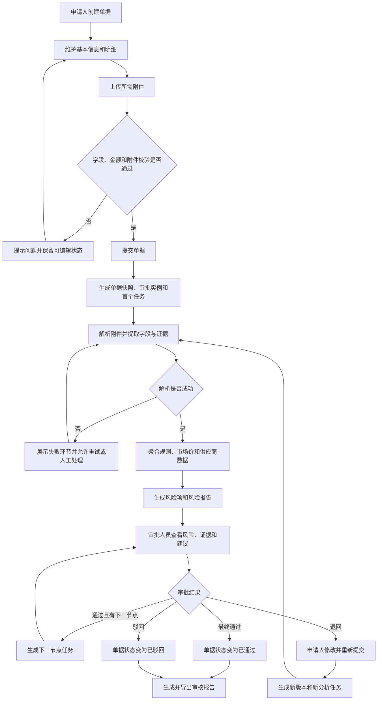

# 财务单据智能风险审核系统 PRD

| 项目 | 内容 |
|---|---|
| 文档版本 | v0.1 |
| 编写日期 | 2026-08-16 |
| 需求来源 | `财务评审文档/财务风险评审项目说明.md` |
| 建设基础 | 独立建设用户、单据、附件、审批、分析、报告与审计能力 |
| 文档状态 | 初稿，待业务与技术评审 |
| 重点审核 | 见 [重点审核门禁与产出清单](../02-概要设计/00-重点审核门禁与产出清单.md) |

## 0. 文档说明

### 0.1 产品定位

财务单据智能风险审核系统面向企业单据申请人、审批人员、财务人员和系统管理员，统一承载财务单据创建、附件管理、审批流转、风险分析、人工复核、报告导出和操作审计。

系统通过结构化单据数据、非结构化附件解析结果、企业审核规则、市场价格参考数据和供应商资料形成可解释的风险结论。智能分析结果只作为审批辅助依据，最终通过、退回或驳回结果必须由审批人员决定。

本系统不负责实际资金支付、银行交易处理、总账记账和电子发票税务查验。上述能力如需建设，应通过后续需求或外部系统集成另行确认。

### 0.2 系统职责边界

| 能力 | 本系统职责 | 外部数据或后续系统职责 |
|---|---|---|
| 用户与权限 | 独立维护用户、角色、权限及数据访问控制 | 企业统一身份认证是否接入待确认 |
| 财务单据 | 创建、编辑、复制、提交、撤回、退回、驳回、通过、作废和版本留痕 | 不负责会计凭证和总账记账 |
| 审批流程 | 配置审批流程、生成任务、记录意见并驱动状态流转 | 不负责外部办公系统中的审批任务 |
| 附件管理 | 上传、存储、预览、下载、删除、格式校验和访问控制 | 原始附件来源及归档期限待确认 |
| 文档解析 | 解析 PDF、PNG、JPG，提取文本、关键字段、证据位置和置信度 | OCR 或模型服务的提供方与部署方式待确认 |
| 风险分析 | 执行确定性规则与智能分析，生成风险项、证据和处理建议 | 不替代人工审批，不自动决定付款 |
| 市场价格 | 保存并使用市场价格参考数据 | 数据来源、授权和更新机制待确认 |
| 供应商风险 | 保存供应商档案、风险标签、黑名单和异常记录 | 外部工商、征信或黑名单数据来源待确认 |
| 风险报告 | 生成、查询和导出审核报告 | 报告签章及外部归档待确认 |
| 操作审计 | 记录关键查询、访问、变更、分析和审批操作 | 企业统一审计平台对接待确认 |

### 0.3 设计约束

1. 系统必须独立保存和管理用户、单据、附件、审批、分析、报告与审计数据。
2. 系统必须支持对公付款单、预付款单、批量付款单、费用报销单和差旅报销单 5 类单据。
3. 非结构化附件首期只要求支持 PDF、PNG、JPG 格式。
4. 所有单据查询、附件访问、风险分析和审批操作必须同时校验登录状态、操作权限和数据权限。
5. 所有金额对比、规则判断和风险结论必须保留计算依据、规则阈值和数据来源。
6. 审批结果、风险项处理、规则变更和附件访问必须可审计。
7. 智能分析失败不得阻止用户查看原始单据及已成功保存的数据，但必须明确展示失败环节和可执行的恢复操作。
8. 技术基线已确认：Python 3.12+、FastAPI、PostgreSQL、Redis + Celery、Vue 3 + TypeScript 和 OpenAPI；OCR 与模型服务通过独立适配层接入。
9. 附件存储采用 `FileStorage` 接口抽象；开发环境使用本地文件存储，生产环境使用 MinIO 对象存储。
10. OCR/模型服务优先采用私有化部署；外部模型只处理脱敏或明确获准的数据。
11. MVP 先实现顺序多节点审批，保留 `approval_mode` 扩展位；复杂审批模式后续再评估。
12. 退回后重新提交时，审批流程从第一个审批节点重新开始；旧审批任务取消并保留历史记录。
13. 数据权限采用最小权限模型：申请人看本人单据，审批人员看分配任务，财务人员看授权组织范围，管理员主要管理系统配置。
14. PRD 只定义业务需求和业务可感知约束；数据库表、接口路径和代码目录在概要设计与模块 SPEC 中确定。

### 0.4 本 PRD 重点审核点

以下内容需要优先审核；其余章节仍需整体审核，但主要属于已确认需求的结构化整理：

| 编号 | 重点审核内容 | 对应章节 |
|---|---|---|
| R-01 | 【已确认】先以费用报销单打通样板链路，再扩展其他 4 类单据；最终范围仍为 5 类单据和 10 类风险规则 | 9. MVP 范围、10. 待确认项 |
| R-02 | 【已确认】最终通过、退回或驳回结果由审批人员决定，AI 只提供审批辅助信息 | 4.7 风险复核、8.6 风险分析与复核 |
| R-03 | 【已确认】申请人看本人单据，审批人员看分配任务，财务人员看授权组织范围，管理员主要管理系统配置 | 2. 用户角色、4.1 认证与权限 |
| R-04 | 【已确认】退回后重新提交时，审批流程从第一个审批节点重新开始；其他状态转换仍按状态机审核 | 3. 总体业务流程、6.1 单据状态 |
| R-05 | 【已确认】MVP 先实现顺序多节点审批，保留 `approval_mode` 扩展位；会签、或签、转交、加签和代理审批后续再评估 | 4.4 审批流程、概要设计总纲 |
| R-06 | 【已确认】金额使用 `Decimal` 保存 2 位小数，保留币种字段；MVP 只比较同币种金额，不做汇率换算 | 4.2.3、4.6.3、6.6、风险报告 |
| R-07 | 【已确认】以确定性规则引擎为风险判定主路径；每个风险项输出实际值、参考值、阈值、来源和证据，LLM 只做字段补全、解释和建议 | 4.6 风险分析、6.4 风险等级与综合评级 |
| R-08 | 【已确认】每个风险结论必须绑定附件、页码或位置、原文片段、提取字段、置信度、规则版本和分析时间；缺证据只能标记为待人工确认 | 4.6.2 风险输出、6.5 版本与证据规则、风险报告 |
| R-09 | 【已确认】OCR 负责识别，结构化抽取负责字段提取，规则引擎负责确定性校验，LLM 负责语义补全/解释/建议，Agent 只编排工具调用，RAG 只检索制度与规则依据 | 4.3、4.6、概要设计总纲、AI 技术设计 |
| R-10 | 【已确认】真实财务数据默认只进入私有化 OCR/模型；外部模型默认禁止，确需外发时必须脱敏、授权、加密并审计 | 7.2 安全与隐私、概要设计、AI 技术设计、部署方案 |
| R-11 | 【已确认】上传、解析、OCR、风险分析、报告生成分别管理任务状态和重试；从失败节点恢复，保留错误原因、日志和幂等键；不可恢复时转人工处理 | 4.3、7.3、核心流程、任务状态机、模块 SPEC |
| R-12 | 【已确认】每次提交或退回重提生成不可变单据版本；附件、解析结果、风险分析、审批实例和报告全部绑定同一版本；新规则或模型只影响新分析 | 3.4、6.5、ER 图、数据对象、报告设计 |
| R-13 | 【已确认】一期优先完成费用报销单主链路页面，其他 4 类单据复用同一页面框架 | 5. 页面与交互、页面原型、前端 SPEC |
| R-14 | 【已确认】先建立量化验收指标框架，再用真实或脱敏样本补齐数值；覆盖识别准确率、规则准确率、证据完整率、任务成功率、重试成功率、响应时间和附件限制 | 7. 非功能需求、8. 验收标准 |
| R-15 | 【已确认】技术基线为 Python 3.12+、FastAPI、PostgreSQL、Redis + Celery、Vue 3 + TypeScript、OpenAPI，OCR 和模型服务通过独立适配层接入 | 0.3 设计约束、概要设计总纲 |
| R-16 | 【已确认】附件存储采用 FileStorage 接口抽象，开发环境使用本地文件存储，生产环境使用 MinIO 对象存储 | 4.3 附件管理与文档解析、概要设计总纲 |
| R-17 | 【已确认】OCR/模型服务优先私有化部署，外部模型只处理脱敏或明确获准的数据 | 0.3 设计约束、7.2 安全与隐私、概要设计总纲 |

## 1. 项目背景与目标

### 1.1 项目背景

财务审核通常需要人工核对单据字段、费用或付款明细、发票、合同、行程单、付款依据、费用标准、供应商记录和市场价格。材料分散、金额口径不一致、附件查阅成本高，容易造成漏审、重复报销、异常付款和审计证据不完整。

现有需求要求建设一套独立运行的系统，在一个工作空间中完成单据全生命周期管理，并将附件解析、风险识别、人工复核、审批和报告串成可追溯链路。

### 1.2 建设目标

1. 建立覆盖 5 类财务单据的统一创建、维护、查询、版本和状态管理能力。
2. 建立附件上传、访问控制、解析、字段提取、原文定位和失败重试能力。
3. 建立可配置的多节点审批流程，完整记录任务、意见、状态和操作人。
4. 建立金额一致性、费用合规、市场价、消费行为、供应商、附件和重复票据等风险识别能力。
5. 为每个风险项提供实际值、参考值、规则阈值、证据位置和处理建议。
6. 通过多轮交互补齐单据类型与单据编号，并在用户权限范围内发起分析。
7. 建立人工复核、风险报告、报告导出和完整审计能力。
8. 使用示例数据跑通“单据创建 → 明细维护 → 附件上传 → 提交审批 → 附件解析 → 风险分析 → 审批处理 → 报告导出”完整链路。

### 1.3 成功判定

项目成功至少满足以下条件：

1. 4 类角色可在各自权限和数据范围内完成规定操作。
2. 5 类单据均可完成规定的全生命周期操作。
3. 受支持附件可被安全访问，并能展示解析文本、提取字段、置信度和证据位置。
4. 10 类风险规则均能输出可解释、可复核、可追溯的结果。
5. 多节点审批、退回重提、版本留痕和报告导出链路可以通过验收用例验证。
6. 性能、解析准确率、可用性和附件容量等量化指标通过评审后补充，未确认前不得作为已达成指标。

## 2. 用户角色

### 2.1 角色职责

| 角色 | 主要职责 | 默认数据范围 |
|---|---|---|
| 单据申请人 | 创建和编辑单据、维护明细、上传附件、保存草稿、提交审批、撤回未处理单据、修改退回单据、查看本人单据状态 | 本人创建的单据 |
| 审批人员 | 查看本人审批任务、发起或查看风险分析、查看证据、填写复核意见、通过、退回或驳回任务 | 分配给本人的审批任务及其关联单据 |
| 财务人员 | 查看授权范围内的单据与分析结果、维护审核规则、市场价参考数据和供应商风险资料、完成人工复核 | 被授权组织范围内的数据 |
| 系统管理员 | 维护用户、角色、权限、审批流程、模型配置和系统参数，查看系统级操作记录 | 默认管理系统配置；业务数据需另行授权 |

### 2.2 权限原则

1. 登录成功不等于拥有全部业务权限。
2. 前端必须根据权限隐藏或禁用不可操作入口，后端必须再次执行强制权限校验。
3. 无权用户不得通过列表数量、搜索候选项、附件地址、分析任务或错误信息推断无权数据。
4. 系统管理员的管理权限不得自动推导为全部财务业务数据权限。
5. 角色、组织、本人、任务归属和单据归属的组合规则待权限矩阵确认。

## 3. 总体业务流程

### 3.1 单据审核主流程



### 3.2 智能审核对话流程

1. 用户进入智能审核对话页并输入审核请求。
2. 请求未包含单据类型时，系统必须询问单据类型。
3. 请求未包含单据编号时，系统必须询问单据编号。
4. 信息存在歧义或冲突时，系统展示用户有权查看的候选项并请求确认。
5. 会话必须保存已经确认的单据类型和单据编号，不重复询问。
6. 信息完整后，系统按照“单据类型 + 单据编号”查询权限范围内的单据。
7. 查询成功后，系统创建分析任务并持续展示当前步骤和进度。
8. 查询、附件读取、解析或分析失败时，系统说明失败环节并提供重试入口。
9. 分析成功后，系统展示整体风险、风险项、证据和报告入口。

## 4. 功能需求

### 4.1 认证与权限

#### 4.1.1 登录与退出

1. 用户通过用户名和密码登录。
2. 登录成功后进入审核工作台；登录失败时必须说明可理解的失败原因，但不得泄露账号是否存在等敏感信息。
3. 系统必须保持有效登录状态，并在登录失效时引导用户重新登录。
4. 用户退出后，原登录凭据不得继续访问受保护资源。
5. 被停用用户不得继续登录；已建立会话的撤销时点待确认。

#### 4.1.2 角色和数据权限

1. 系统管理员可维护用户、角色和权限关系。
2. 页面、按钮、接口和数据对象必须采用一致的权限口径。
3. 单据、附件、风险分析、审批任务、报告和审计记录必须按数据权限过滤。
4. 对无权资源的直接访问必须拒绝，不得返回资源内容。

### 4.2 单据管理

#### 4.2.1 单据类型

系统必须支持以下单据：

| 单据类型 | 通用信息 | 专属信息 |
|---|---|---|
| 对公付款单 | 单据编号、申请人、申请部门、预算部门、收款单位、收款账号、费用类别、总金额、币种、申请日期、事由 | 合同编号、供应商名称、付款比例、付款条件、计划付款日期 |
| 预付款单 | 同上 | 合同编号、供应商名称、付款比例、付款条件、计划付款日期 |
| 批量付款单 | 同上 | 付款明细、收款对象、单笔金额、批次总金额、付款笔数 |
| 费用报销单 | 同上 | 费用明细、消费日期、消费地点、费用科目、报销金额 |
| 差旅报销单 | 同上 | 出差地点、出差起止日期、交通费、住宿费、餐费、补贴金额 |

各字段的长度、精度、是否必填、默认值、条件必填和跨字段校验在数据对象文档中确定。当前无法确认的规则不得由实现人员自行假设。

#### 4.2.2 创建、编辑和保存

1. 申请人可创建 5 类单据并保存为草稿。
2. 草稿和退回状态的单据允许有权限的申请人编辑。
3. 进入不可编辑状态后，页面必须以只读方式展示或明确禁用编辑入口。
4. 保存失败时，系统必须保留用户已填写内容并展示可恢复提示。
5. 同一单据编号的唯一范围和编号生成方式待确认。

#### 4.2.3 明细管理与金额校验

1. 系统必须支持费用明细和付款明细的新增、修改和删除。
2. 系统必须自动计算明细合计，并与单据总金额比较。
3. 删除明细前必须确认；已经进入审批快照的历史明细不得被物理覆盖。
4. 金额精度、舍入方式、允许误差和多币种处理方式待确认。

#### 4.2.4 查询与详情

1. 用户可按单据编号、单据类型、申请人、部门、状态和日期查询权限范围内的单据。
2. 列表必须支持分页、无数据状态、加载状态和失败重试。
3. 详情必须展示基本信息、明细、附件、版本、审批进度和状态记录。
4. 默认排序、分页大小和可导出的列表范围待确认。

#### 4.2.5 复制、提交、撤回和作废

1. 复制操作必须生成新草稿，不得复用原单据编号；附件是否复制待确认。
2. 提交前必须校验字段完整性、明细合计和必需附件。
3. 提交成功后必须生成当前版本快照、审批实例和首个审批任务。
4. 只有尚未被审批人员处理且符合撤回条件的单据允许撤回。
5. 作废操作必须二次确认，并受状态和权限限制。
6. 撤回及作废后的重新编辑、重新提交和恢复规则待确认。

### 4.3 附件管理与文档解析

#### 4.3.1 附件管理

1. 用户可在有权限的单据下上传、预览、下载和删除附件。
2. 支持的格式为 PDF、PNG 和 JPG；文件大小、页数和单据附件总量待确认。
3. 系统必须校验文件类型、文件大小、文件路径和访问权限。
4. 删除只允许发生在业务规则允许的状态；历史版本引用的附件不得被无痕移除。
5. 上传、下载、预览和删除操作必须记录审计信息。

#### 4.3.2 附件解析

1. 系统必须支持 PDF 文本提取和图片 OCR 识别。
2. 系统必须识别发票、合同、行程单、付款依据和费用明细等附件类别。
3. 解析结果必须保存全文、提取字段、页码、文本位置和识别置信度。
4. 用户可在原图或原文与识别文本之间查看字段来源。
5. 解析失败时必须展示失败状态和失败原因，并允许有权限用户重试。
6. 低置信度进入人工复核的阈值和处理流程待确认。

### 4.4 审批流程

#### 4.4.1 流程配置

1. 系统管理员可按单据类型、金额区间和部门维护审批流程。
2. 流程至少包含节点名称、节点顺序和审批角色。
3. 流程启停、修改对运行中审批实例的影响待确认。
4. MVP 只实现顺序多节点审批；会签、或签、转交、加签和代理审批暂不纳入，审批流程保留 `approval_mode` 扩展位。

#### 4.4.2 审批任务

1. 单据提交后，系统必须匹配唯一有效流程并生成审批实例和首个待办任务。
2. 审批人员只能处理分配给本人且处于待处理状态的任务。
3. 审批人员可提交通过、退回或驳回，并填写审批意见。
4. 当前节点通过后，如存在下一节点，系统必须生成下一节点任务。
5. 最后一个节点通过后，单据状态变为已通过。
6. 重复提交同一审批动作不得造成重复任务或重复状态流转。
7. 并发处理、流程匹配失败和任务生成失败必须有明确状态与恢复措施。

#### 4.4.3 退回与重新提交

1. 退回后，申请人可修改单据并重新提交。
2. 重新提交必须生成新版本和新的分析任务。
3. 旧版本、旧分析结果和旧审批意见必须保留，不得被新版本覆盖。
4. 重新提交后必须从第一个审批节点重新开始，旧审批任务取消并保留历史记录。

### 4.5 智能审核会话与分析任务

1. 用户可创建审核会话，系统必须保存消息和已确认的槽位信息。
2. 会话至少维护单据类型、单据编号和会话状态。
3. 单据候选项必须经过数据权限过滤。
4. 分析任务必须展示排队、查询单据、加载附件、解析附件、分析、成功、失败或取消等状态。
5. 用户刷新页面或重新进入后，应能恢复会话历史和任务当前状态。
6. 任务失败时必须保存失败步骤和可理解的错误信息；是否允许从失败步骤续跑待确认。

### 4.6 风险分析

风险判定以可重复、可审计的确定性规则引擎为主。LLM 不得直接改变规则命中结果或审批状态，仅可用于字段补全、跨文档语义解释和处理建议生成；所有 LLM 输出必须标明模型、提示版本和置信度，并接受规则与人工复核约束。

组件职责边界固定如下：OCR 负责文字与版面识别；结构化抽取负责字段提取；规则引擎负责确定性校验；LLM 负责语义补全、解释和建议；Agent 只负责受限的工具编排，不得自主改变业务状态；RAG 只负责检索制度、费用标准和规则依据。各组件的输入、输出、版本和调用链必须记录。

#### 4.6.1 分析输入

系统必须聚合以下数据：

- 单据结构化字段及当前版本；
- 费用明细或付款明细；
- 附件原文、提取字段、置信度和证据位置；
- 当前有效审核规则和阈值；
- 市场价格参考数据；
- 供应商档案、风险标签和历史异常。

#### 4.6.2 风险输出

每个风险项必须包含：

- 风险类型、标题、描述和风险等级；
- 实际值、参考值和规则阈值；
- 数据来源及附件证据位置；
- 处理建议和分析时间；
- 人工复核状态。

风险结论必须绑定可定位证据，包括附件、页码或位置、原文片段、提取字段、识别置信度、所用规则版本和分析时间。缺少必要证据时，不得直接标记为确定风险，只能标记为“待人工确认”。

#### 4.6.3 风险类型

| 风险类型 | 判断目标 | 必须展示的核心结果 |
|---|---|---|
| 单据与发票金额一致性 | 申请或报销金额与发票含税金额合计是否一致 | 差异金额、差异比例、容差和发票来源 |
| 明细与总金额一致性 | 明细合计与单据总金额是否一致 | 明细合计、总金额、差异及重复或漏项提示 |
| 合同与付款一致性 | 合同主体、金额、条件和比例是否与付款一致 | 对比字段、差异、合同证据 |
| 批量付款一致性 | 付款笔数、明细合计、批次总金额和账号是否异常 | 笔数、合计差异、重复账号和重复付款提示 |
| 费用标准合规性 | 费用是否符合类别、部门、职级、地区和日期标准 | 实际费用、适用标准、超标值和适用条件 |
| 市场价格合理性 | 商品或服务价格是否偏离参考区间 | 实际价格、参考区间、偏离比例和价格来源 |
| 消费行为异常 | 是否存在高频、重复、节假日、异地、拆单或突增 | 异常模式、时间窗口、历史基线和命中记录 |
| 供应商风险 | 是否存在黑名单、资质、关联、履约、账号或集中付款风险 | 风险标签、异常记录、账号变化和数据来源 |
| 附件完整性 | 必需附件、清晰度、关键字段和主体是否完整一致 | 缺失附件、低质量项、缺失字段和主体差异 |
| 重复票据风险 | 发票是否重复提交 | 发票代码、号码、金额、日期、销售方和历史关联单据 |

### 4.7 风险复核与审批辅助

1. 审批人员和有权限的财务人员可查看风险概览、风险明细、判断依据、证据位置和处理建议。
2. 风险项复核状态至少包含待复核、已确认和已排除。
3. 人工复核必须记录复核人、复核结论、复核意见和复核时间。
4. 排除风险项不得删除原始分析结果，必须保留排除原因和操作记录。
5. 系统提供建议通过、补充材料、人工复核和建议驳回 4 类处理建议，但不得替代审批人员做最终决定。

### 4.8 规则、市场价与供应商资料

1. 财务人员可维护金额容差、费用标准、市场价区间、异常阈值和供应商风险规则。
2. 规则变更必须记录变更前后内容、操作人和操作时间。
3. 分析报告必须能够识别所使用的规则或数据版本；具体版本策略待确认。
4. 市场价参考数据至少包含商品或服务名称、规格、地区、价格区间、币种、来源和生效日期。
5. 供应商资料至少包含供应商编码、名称、信用状态、黑名单状态、风险标签和收款账号。
6. 历史付款、履约异常、关联交易和账号变更的数据来源与维护方式待确认。

### 4.9 工作台、报告与审核记录

#### 4.9.1 审核工作台

1. 展示当前用户权限范围内的待审批单据数量、高中低风险数量、单据类型分布、最近分析任务和待人工复核事项。
2. 每项统计必须支持进入对应列表，统计口径、时间范围和刷新频率待确认。
3. 无权限、无数据、加载中和加载失败必须有明确展示。

#### 4.9.2 风险报告

报告至少包含：

- 单据摘要；
- 整体风险等级及高中低风险数量；
- 单据、明细、发票、合同和付款金额核对；
- 风险项及实际值、参考值、阈值和建议；
- 附件名称、页码、原文片段、结构化字段和置信度；
- 供应商风险标签、黑名单状态、历史异常和账号变化；
- 人工复核人、结论、意见和时间。

报告导出格式、文件命名、是否加水印或签章待确认。

#### 4.9.3 审核记录与审计

1. 有权限用户可查询历史分析报告、人工复核意见、审批结果和状态记录。
2. 系统必须记录用户登录、单据操作、附件访问、规则变更、分析任务和审批操作。
3. 审计记录不得由普通业务用户修改或删除。
4. 审计日志的查询权限、保留期限、归档和脱敏规则待确认。

## 5. 页面清单

| 一级菜单 | 页面 | 页面职责 |
|---|---|---|
| 认证 | 登录页 | 用户名和密码登录、失败提示和登录状态建立 |
| 工作台 | 审核工作台 | 展示审批、风险、任务和待复核统计及快捷入口 |
| 单据管理 | 单据管理页 | 按条件查询单据，并提供新建、复制、撤回和作废入口 |
| 单据管理 | 单据编辑页 | 维护基本信息、费用或付款明细和附件，保存草稿或提交审批 |
| 单据管理 | 单据详情页 | 查看单据、明细、附件、版本、审批进度和状态记录 |
| 智能审核 | 智能审核对话页 | 补齐单据类型和编号、发起分析并展示任务进度 |
| 智能审核 | 附件解析页 | 对照原图或原文、识别文本、提取字段、置信度和证据位置 |
| 智能审核 | 风险分析页 | 展示整体风险、分类统计、风险项、证据和处理建议 |
| 智能审核 | 金额核对面板 | 对照单据、明细、发票、合同和付款金额并突出差异 |
| 供应商管理 | 供应商风险页 | 查看供应商信息、历史付款、风险标签、黑名单和异常记录 |
| 审批管理 | 我的审批任务页 | 查询待处理和已处理任务，并提交通过、退回或驳回 |
| 系统配置 | 审批流程配置页 | 按单据类型、金额和部门维护审批节点及角色 |
| 系统配置 | 规则配置页 | 维护金额容差、费用标准、市场价和风险阈值 |
| 审核记录 | 审核记录页 | 查询历史报告、复核意见、审批结果和操作记录 |

用户、角色、权限、模型配置和系统参数的管理页面是否独立建设，待概要设计和产品评审确认。

## 6. 核心业务规则

### 6.1 单据状态

| 状态 | 进入条件 | 允许的主要操作 | 退出方向 |
|---|---|---|---|
| `draft` | 创建新单据或复制生成草稿 | 编辑、维护明细、上传附件、提交、作废 | `pending_review`、`voided` |
| `pending_review` | 提交成功并已生成审批实例 | 查看；符合条件时撤回 | `reviewing`、`withdrawn`、失败恢复状态待确认 |
| `reviewing` | 审批任务开始处理 | 查看、分析、复核、审批 | `approved`、`returned`、`rejected` |
| `returned` | 审批人员退回 | 编辑、补充附件、重新提交、按规则作废 | `pending_review`、`voided` |
| `approved` | 最终审批节点通过 | 查看、导出报告 | 终态；是否允许作废待确认 |
| `rejected` | 审批人员驳回 | 查看、导出报告 | 终态；是否允许重新发起待确认 |
| `withdrawn` | 申请人在允许条件下撤回 | 查看；后续编辑或重新提交规则待确认 | 待确认 |
| `voided` | 有权限用户在允许状态作废 | 查看历史记录 | 终态 |

任何未在状态规则中定义的转换都必须拒绝，并记录必要的失败信息。

### 6.2 审批状态

1. 审批实例状态至少包含 `pending`、`running`、`approved`、`returned`、`rejected`、`cancelled`。
2. 审批任务状态至少包含 `pending`、`approved`、`returned`、`rejected`、`cancelled`。
3. 同一任务只能成功处理一次；重复请求必须返回一致结果或明确提示已处理。
4. 单据撤回、作废或重新提交时，所有不再有效的审批任务必须取消并保留历史。

### 6.3 附件与分析状态

1. 附件存储状态至少包含 `uploading`、`stored`、`failed`。
2. 附件解析状态至少包含 `pending`、`parsing`、`succeeded`、`failed`、`manual_review`。
3. 分析任务状态至少包含 `queued`、`querying_document`、`loading_attachments`、`parsing_attachments`、`analyzing`、`succeeded`、`failed`、`cancelled`。
4. 状态变化必须记录时间；任务失败必须记录失败步骤和错误信息。
5. 已成功生成的报告必须绑定单据版本和分析任务，不得被后续分析无痕覆盖。

### 6.4 风险等级与综合评级

1. 单项风险等级至少包含 `low`、`medium`、`high`。
2. 整体风险等级以最高单项风险为基础，并结合风险数量进行确定性修正。
3. 数量修正、无风险等级和已排除风险是否参与汇总的具体参数，必须配置化并在概要设计阶段固化，禁止由 LLM 临时决定。
4. 所有评级必须能够追溯到输入数据、规则阈值、规则版本和分析时间。

### 6.5 版本与证据规则

1. 首次提交和每次退回后重新提交都必须生成不可变的单据版本快照。
2. 附件、解析结果、风险项、审批实例和报告必须能够关联到对应单据版本。
3. 证据必须至少包含来源类型、附件名称、页码或位置、原文片段、提取字段、置信度、规则版本和分析时间。
4. 缺少必要证据的风险结论只能标记为“待人工确认”，不得作为已确认风险参与自动化汇总。
5. 原始分析结果和人工处理记录不得相互覆盖。

### 6.6 金额规则

1. 金额比较必须展示实际值、参考值、差异金额、差异比例、容差和币种。
2. 金额计算不得使用会产生不可控精度误差的方式。
3. 金额使用 `Decimal` 保存 2 位小数，保留币种字段；MVP 只比较同币种金额，不做汇率换算。
4. 税额处理、跨币种业务和未来汇率扩展另行确认，不得在 MVP 中隐式换算。

## 7. 非功能需求

### 7.1 性能与容量

以下指标尚无可靠需求依据，必须在概要设计前确认：

- 同时在线用户数和峰值并发请求数；
- 单据总量、日新增量和历史保存期限；
- 单文件大小、最大页数、单据附件数量和总容量；
- 页面和查询响应时间；
- OCR、风险分析和报告生成的目标耗时；
- 工作台统计范围和刷新频率。

在指标确认前，产品验收不得使用“响应快速”等不可量化表述。

### 7.2 安全与隐私

1. 密码必须以安全哈希方式保存，不得保存或记录明文密码。
2. 访问凭据必须设置有效期和撤销机制。
3. 单据、附件、供应商资料和分析结果必须按用户权限访问。
4. 附件访问必须校验文件标识和业务权限，不得依赖可猜测的文件路径直接访问。
5. 收款账号、身份证件、发票和合同等敏感信息的展示与日志脱敏规则待确认。
6. 真实财务数据默认只进入私有化 OCR/模型；外部模型默认禁止。确需外发时，必须脱敏、审批授权、最小化传输、加密、控制留存期限并记录调用审计。
7. 智能分析结果必须明确标识为审批辅助信息。

### 7.3 可用性与可观测性

1. 上传、解析、分析、报告等长耗时任务必须展示状态、当前步骤和失败原因。
2. 可恢复失败必须提供重试入口；不可恢复失败必须提供处理建议。
3. 上传、解析、OCR、风险分析和报告生成必须独立记录任务状态、重试次数、错误原因、任务日志和幂等键；重试从失败节点继续，不得默认整链路重跑。
4. 用户刷新页面或重新登录后，应能继续查看已创建任务的最新状态。
5. 关键任务必须记录开始时间、结束时间、当前步骤和错误信息。
5. 告警范围、重试次数、超时阈值和故障恢复目标待确认。

### 7.4 兼容性

1. 附件输入格式首期支持 PDF、PNG 和 JPG。
2. 目标浏览器、最低分辨率、移动端适配、操作系统和国产化环境要求待确认。
3. 扫描件语言、旋转页面、手写内容、加密 PDF 和超大图片的支持边界待确认。

### 7.5 审计与留存

1. 所有关键业务操作必须记录操作人、操作时间、资源和变更内容。
2. 日志不得记录密码、完整访问凭据等高敏感信息。
3. 审计日志、原始附件、解析结果和报告的保存期限及归档策略待确认。

## 8. 验收标准

### 8.1 认证与权限

1. 使用有效账号登录时，系统进入审核工作台并返回当前用户及权限信息。
2. 使用无效密码或停用账号登录时，系统拒绝访问且不泄露敏感账号信息。
3. 用户直接访问无操作权限的页面或接口时，前后端均不得返回受保护内容。
4. 申请人不能查询或下载权限范围外的单据和附件。
5. 审批人员不能处理未分配给本人的审批任务。

### 8.2 单据管理

1. 申请人可分别创建 5 类单据，保存通用字段和对应专属字段。
2. 草稿保存后重新进入，已保存字段、明细和附件信息能够正确回显。
3. 明细变更后，系统重新计算合计并展示与单据总金额的差异。
4. 缺少必填字段、金额校验不通过或缺少必需附件时，提交被拒绝并定位到具体问题。
5. 提交成功后，系统生成版本快照、审批实例和首个审批任务。
6. 不符合撤回或作废条件的操作被拒绝，原状态和历史记录保持不变。
7. 退回单据修改后重新提交，系统生成新版本，旧版本仍可查询。

### 8.3 附件与解析

1. 上传 PDF、PNG 或 JPG 时，系统保存附件并展示存储和解析状态。
2. 上传不支持格式、超出限制或伪装格式的文件时，系统拒绝保存并说明原因。
3. 有权限用户可预览和下载附件；无权限用户不能通过直接地址访问。
4. 解析成功后，页面展示原文、识别文本、提取字段、置信度及字段来源位置。
5. 解析失败后，页面展示失败环节并允许有权限用户重试。

### 8.4 审批流程

1. 符合流程条件的单据提交后，系统匹配流程并生成首节点任务。
2. 节点通过且存在下一节点时，当前任务完成并生成下一节点任务。
3. 最终节点通过后，单据和审批实例均进入通过状态。
4. 退回后申请人可按规则修改并重新提交；驳回后单据进入驳回状态。
5. 对同一审批任务重复提交处理请求，不会生成重复任务或重复状态记录。
6. 审批意见、处理人和处理时间可在审批进度与审核记录中查询。

### 8.5 智能审核会话

1. 首次输入缺少单据类型时，系统只询问缺失的单据类型。
2. 首次输入缺少单据编号时，系统只询问缺失的单据编号。
3. 用户确认信息后，后续消息不重复询问已经确认的槽位。
4. 存在歧义时，候选项只包含用户有权查看的数据。
5. 单据不存在或用户无权限时，系统不发起分析且不泄露受保护信息。
6. 分析过程中，页面可查看任务状态、当前步骤和进度；失败时可查看失败环节。

### 8.6 风险分析与复核

1. 系统能够分别执行第 4.6.3 节列出的 10 类风险检查。
2. 每个金额风险项展示计算值、对比值、差异、阈值、币种和数据来源。
3. 每个附件风险项可以定位到附件名称、页码或文本位置和原文片段。
4. 整体风险等级与单项风险等级、数量及汇总规则一致。
5. 人工确认或排除风险项后，系统保存复核人、结论、意见和时间，原风险结果仍保留。
6. 智能建议不会直接将单据置为最终通过或驳回状态。

### 8.7 报告与审计

1. 分析成功后，用户可查询包含单据摘要、风险概览、金额核对、风险项、证据、供应商风险和人工复核内容的报告。
2. 有权限用户可导出报告，导出内容与页面所绑定的单据版本一致。
3. 单据状态变化、审批意见、风险项处理和规则变更均能查询到操作人、时间和变更内容。
4. 附件访问和分析任务操作能够在审计记录中追溯。

### 8.8 端到端验收

使用示例数据分别覆盖 5 类单据，并至少成功执行一次以下完整链路：

```text
单据创建 → 明细维护 → 附件上传 → 提交审批 → 附件解析
→ 风险分析 → 人工复核 → 多节点审批 → 报告查询与导出 → 审计追溯
```

同时必须覆盖附件解析失败重试、单据退回重提、无权限访问和重复审批提交等异常链路。

### 8.9 量化指标框架

验收指标先建立指标定义、统计口径、样本范围和采集方式，再使用真实或脱敏样本补齐目标值。至少包括：字段识别准确率、风险规则准确率、证据完整率、任务成功率、重试成功率、页面响应时间、报告生成时间和附件大小/页数/数量限制。未完成样本验证前，目标值只能作为待定值。

## 9. MVP 范围

### 9.1 本期包含

依据当前需求基线，本期包含：

- 4 类用户角色及登录、角色权限和数据权限校验；
- 5 类财务单据、明细、附件、版本和完整状态流转；
- 开发顺序先以费用报销单打通完整样板链路，再扩展其他 4 类单据；
- 可配置的多节点审批流程及任务处理；
- PDF、PNG、JPG 附件管理与解析；
- 单据类型和单据编号的多轮信息补齐；
- 第 4.6.3 节列出的 10 类风险分析；
- 风险概览、金额核对、证据定位和供应商风险展示；
- 人工复核、报告导出和操作审计；
- 可运行前端、后端、数据库初始化、文件存储、示例数据和完整演示链路。

### 9.2 本期不包含

以下内容没有出现在当前已确认需求中，不纳入本期承诺：

- 实际支付、银行转账、资金清算和支付状态回写；
- 会计凭证生成、总账记账、预算占用和预算释放；
- 电子发票税务平台查验；
- 外部 ERP、OA、统一身份认证或第三方审批平台集成；
- 自动替代人工做出最终审批结论；
- PDF、PNG、JPG 以外附件格式；
- 原生移动端应用。

如上述能力在后续被确认，应通过 PRD 变更进入范围，不得在开发阶段默认扩展。

## 10. 待确认项

| 编号 | 待确认问题 | 影响范围 | 建议方向 |
|---|---|---|---|
| Q-01 | 费用报销样板链路通过后，其他 4 类单据的扩展顺序及各阶段验收节点 | 排期、MVP 和验收 | 按业务价值和数据准备情况排序 |
| Q-02 | 用户、部门、职级和数据权限的组织模型 | 权限、查询、审批和费用标准 | 形成独立角色权限与数据范围矩阵 |
| Q-03 | 5 类单据字段的必填、长度、精度、默认值和条件校验 | 表单、数据对象和验收 | 在数据对象文档中逐字段确认 |
| Q-04 | 各单据类型的必需附件矩阵 | 提交校验和附件完整性风险 | 按单据类型、金额和费用类别定义 |
| Q-05 | 单据编号生成及唯一范围 | 创建、复制和并发 | 明确自动生成或人工录入及唯一维度 |
| Q-06 | 税额处理、跨币种业务和未来汇率扩展规则 | 金额核对和风险结论 | MVP 只做同币种比较，不做汇率换算；后续另行确认 |
| Q-07 | 撤回、作废、驳回后的可恢复和重新提交规则 | 状态机和版本 | 形成完整合法状态转换表 |
| Q-08 | 除退回重提外，是否支持转交、加签、代理审批等特殊审批操作 | 审批模型和页面 | MVP 先按顺序审批实现，特殊模式另行确认 |
| Q-09 | 会签、或签、转交、加签和代理审批是否支持 | 审批模型和页面 | MVP 只保留已确认模式，避免默认扩展 |
| Q-10 | 流程或规则修改对运行中实例和历史报告的影响 | 版本、一致性和审计 | 运行实例绑定发布版本，历史结果不可变 |
| Q-11 | 附件大小、页数、数量、总容量及保存期限 | 存储、安全和性能 | 结合真实样本和部署资源量化 |
| Q-12 | OCR、字段提取准确率及低置信度阈值 | 解析验收和人工复核 | 以脱敏样本集定义字段级指标 |
| Q-13 | 智能分析使用的数据边界、模型部署方式和数据保留政策 | 安全、隐私和合规 | 优先确认财务数据是否允许出域 |
| Q-14 | 市场价、节假日、供应商黑名单和历史付款的数据来源 | 风险规则有效性 | 明确维护责任、更新频率和失效机制 |
| Q-15 | 综合风险等级的精确汇总公式 | 风险结果和报告 | 定义高、中、低数量修正规则及人工排除影响 |
| Q-16 | 报告导出格式、命名、水印、签章和归档要求 | 报告模块和验收 | 明确至少一种首期格式 |
| Q-17 | 在线用户、数据规模、响应时间和任务耗时目标 | 非功能验收和架构 | 在概要设计前完成容量基线评审 |
| Q-18 | 目标浏览器、分辨率、国产化和移动端要求 | 前端兼容性 | 以实际使用环境为准，不默认承诺全平台 |
| Q-19 | 审计、附件、解析结果和报告的保存、归档和删除规则 | 合规和存储成本 | 由财务、审计和安全负责人共同确认 |
| Q-20 | 用户、角色、模型配置和系统参数是否需要独立管理页面 | 页面清单和权限 | 在原型评审时确认页面范围 |

## 11. 已确认业务决策

1. 系统独立运行并独立管理核心业务数据。
2. 系统支持 4 类角色和 5 类主要财务单据。
3. 附件首期支持 PDF、PNG 和 JPG。
4. 系统提供多轮交互、附件解析、风险分析、人工复核、多节点审批、报告和审计能力。
5. 风险分析是审批辅助能力，最终通过、退回或驳回结果仍由审批人员决定。
6. 开发先以费用报销单打通完整样板链路，再扩展其他 4 类单据；最终范围不缩减。
7. 所有风险结论必须保留阈值、来源和证据位置。
8. 技术基线为 Python 3.12+、FastAPI、PostgreSQL、Redis + Celery、Vue 3 + TypeScript 和 OpenAPI；OCR 与模型服务通过独立适配层接入。
9. 附件存储采用 `FileStorage` 接口抽象；开发环境使用本地文件存储，生产环境使用 MinIO 对象存储。
10. OCR/模型服务优先采用私有化部署；外部模型只处理脱敏或明确获准的数据。
11. 金额使用 `Decimal` 保存 2 位小数，保留币种字段；MVP 只比较同币种金额，不做汇率换算。
12. 风险判定以确定性规则引擎为主；LLM 仅用于字段补全、解释和建议，不得直接改变风险命中结果或审批状态。
13. 每个风险结论必须绑定附件、页码或位置、原文片段、提取字段、置信度、规则版本和分析时间；缺证据只能标记为待人工确认。
14. OCR、结构化抽取、规则引擎、LLM、Agent 和 RAG 按已确认职责边界协作；Agent 不得自主改变业务状态，所有调用链必须可审计。
15. 真实财务数据默认只进入私有化 OCR/模型；外部模型默认禁止，确需外发时必须经过脱敏、审批授权、最小化传输、加密、留存期限控制和调用审计。
16. 上传、解析、OCR、风险分析和报告生成分别管理任务状态和重试；任务从失败节点恢复并保留错误原因、日志和幂等键；不可恢复时转人工处理。
17. 每次提交或退回重提生成不可变单据版本；附件、解析结果、风险分析、审批实例和报告全部绑定同一版本；规则或模型新版本不得改写历史结果。
18. 一期优先完成费用报销单主链路页面：工作台、创建/编辑、明细与附件、解析、风险分析、人工复核、审批处理、报告详情与导出；其他 4 类单据复用页面框架。
19. 一期先建立量化验收指标框架，再使用真实或脱敏样本补齐数值；未完成样本验证前，不将未经验证的目标值作为已达成指标。
