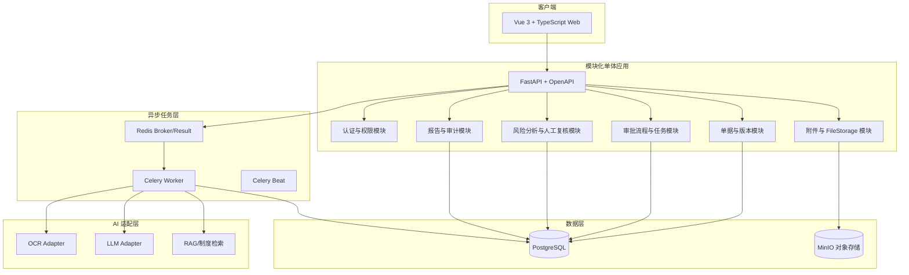
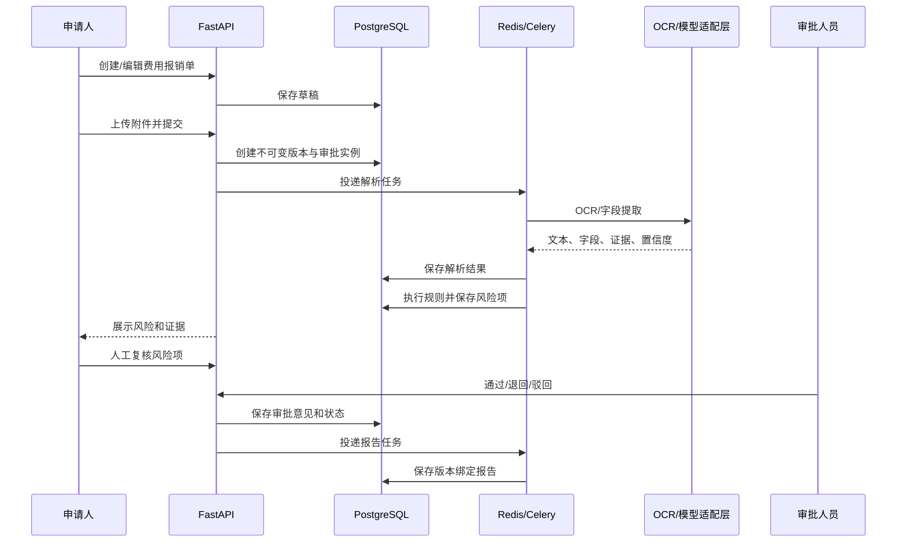
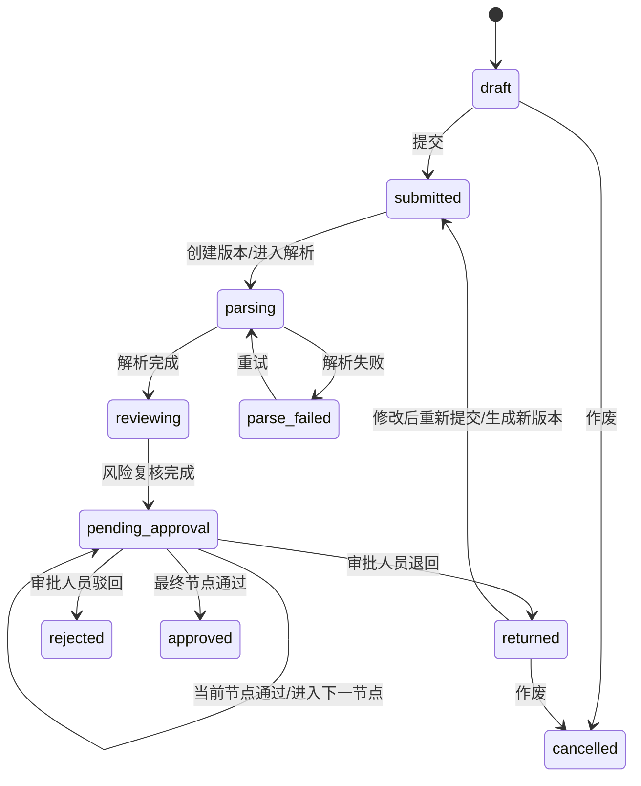
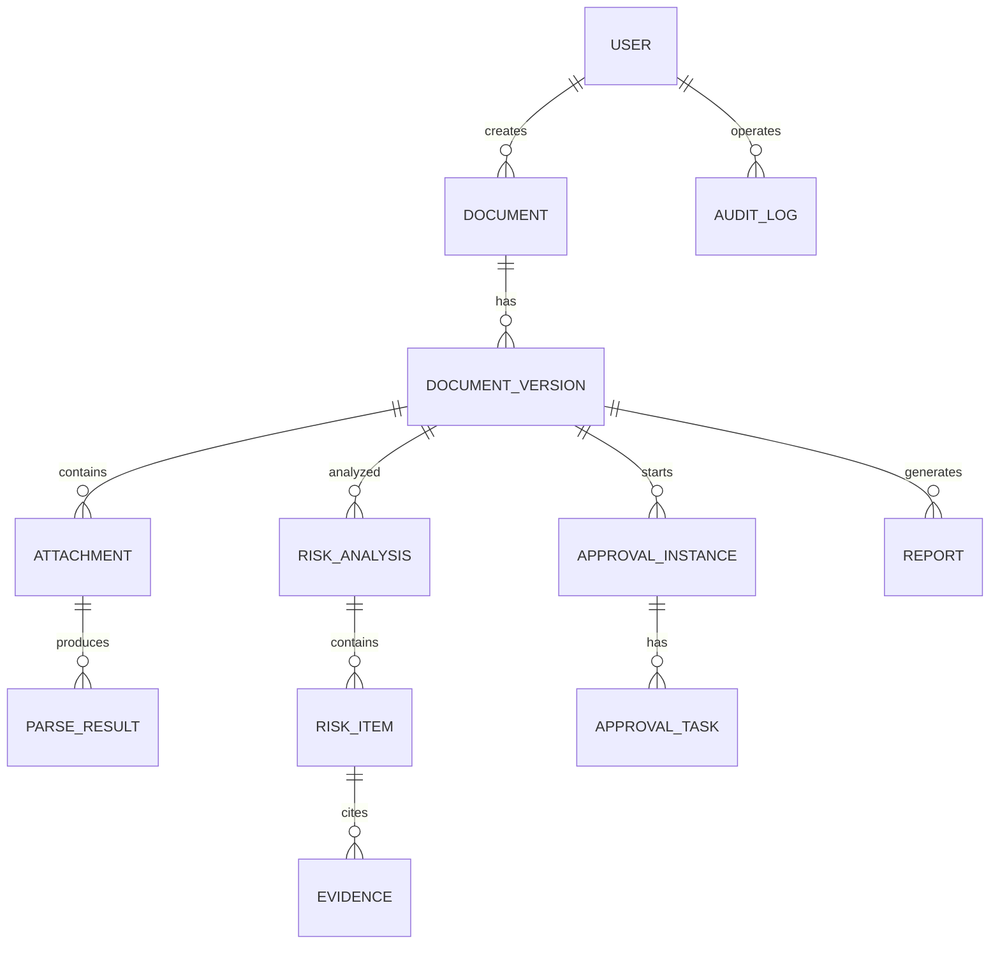

# 财务单据智能风险审核系统概要设计总纲

> 版本：V0.1
>
> 依据：[PRD](../01-PRD/财务单据智能风险审核系统-PRD.md) 和 [方案决策与待确认项](./01-方案决策与待确认项.md)。
>
> 审核说明：本文档需要整体审核；标记“【重点审核】”的段落是优先核对项。

## 1. 设计目标与范围

### 1.1 一期目标

以费用报销单打通“创建 → 明细 → 附件 → 解析 → 风险分析 → 人工复核 → 顺序审批 → 报告 → 审计”完整样板链路。其他 4 类单据复用领域模型、风险规则框架和页面框架。

### 1.2 架构原则

1. 模块化单体优先：一个可独立部署的应用，内部按领域模块隔离边界。
2. 人工审批优先：AI 只提供辅助结果，不改变最终审批状态。
3. 规则可审计：风险规则、阈值、数据来源、证据和版本均可追溯。
4. 异步任务可恢复：长耗时任务通过 Celery 执行，按失败节点重试。
5. 存储可替换：业务代码只依赖 `FileStorage`，生产使用 MinIO。
6. 私有化优先：真实财务数据默认不出域，外部模型调用必须受控。

## 2. 总体架构

### 2.1 逻辑架构



【重点审核 R-15、R-16、R-17】确认技术栈、MinIO、适配层和数据出域控制是否符合部署条件。

### 2.2 模块边界

| 模块 | 核心职责 | 不负责 |
|---|---|---|
| 认证与权限 | 用户、角色、组织、数据权限和访问鉴权 | 外部统一身份认证的具体实现 |
| 单据与版本 | 5 类单据、草稿、提交、版本快照和状态 | 会计凭证和总账记账 |
| 附件与解析 | 上传、格式校验、FileStorage、解析任务、证据定位 | 业务风险结论 |
| 审批流程 | 流程配置、顺序节点、审批任务和状态流转 | 替审批人员作决定 |
| 风险分析 | 规则执行、模型适配、风险项和综合评级 | 最终通过/退回/驳回 |
| 人工复核 | 风险确认、排除、意见和复核记录 | 删除原始分析结果 |
| 报告与审计 | 报告生成、导出、操作审计和版本关联 | 修改历史报告 |

## 3. 核心流程



【重点审核 R-02、R-04、R-08、R-11、R-12】核对最终审批责任、退回重提、证据链、失败恢复和版本绑定。

## 4. 单据状态机



【重点审核 R-04、R-05】MVP 仅支持顺序审批；退回重提必须从第一个审批节点重新开始，旧任务取消但历史保留。

## 5. 数据关系概览



【重点审核 R-03、R-06、R-08、R-12】数据权限、金额字段、证据对象和版本关联将在数据对象文档中细化。

## 6. 中间件与部署

| 组件 | 用途 | 一期部署建议 |
|---|---|---|
| PostgreSQL | 业务数据、版本、风险、审批、报告、审计 | Docker Compose 开发/测试；生产独立数据库或高可用集群 |
| Redis | Celery Broker、任务结果和短期缓存 | Docker Compose 开发/测试；生产独立 Redis |
| Celery Worker | OCR、解析、风险分析、报告等异步任务 | 与 API 分离进程，可水平扩展 |
| Celery Beat | 定时清理、重试扫描和数据维护 | 按需启用，单实例运行 |
| MinIO | 生产附件对象存储 | 生产环境部署；开发可使用本地 FileStorage |
| OCR/LLM 服务 | 文档识别、字段抽取和语义辅助 | 通过独立 Adapter 接入，优先私有化 |

## 7. 技术框架与代码规范

### 7.1 技术基线

- Python 3.12+
- FastAPI + Pydantic + SQLAlchemy/Alembic
- PostgreSQL
- Redis + Celery
- Vue 3 + TypeScript
- OpenAPI 作为前后端接口契约
- OCR/LLM/RAG 通过适配器接口隔离供应商实现

### 7.2 代码组织建议

```text
backend/
  app/
    modules/
      auth/
      documents/
      attachments/
      workflow/
      risk_review/
      reports/
      audit/
    adapters/
      ocr/
      llm/
      rag/
      storage/
    workers/
    shared/
frontend/
  src/modules/
  src/api/
  src/components/
```

### 7.3 关键规范

1. 金额字段使用 `Decimal`，保存 2 位小数并保留币种。
2. 所有异步任务必须具备幂等键、状态、重试次数和错误信息。
3. 所有风险项必须可追溯到规则版本和证据对象。
4. 所有接口执行认证、功能权限和数据权限校验。
5. 所有状态变更和敏感访问写入审计日志。
6. API 先定义 OpenAPI 契约，再实现前后端代码。
7. 文件业务模块只依赖 `FileStorage` 接口，不直接调用本地文件或 MinIO SDK。

## 8. 待在后续文档固化的参数

## 9. 单 Agent 运行时设计

智能审核采用单 Agent 编排、多引擎协作模式。Agent 只负责受限工具编排，不直接修改审批状态；运行时、固定状态机、会话状态、SSE、工具注册、提示词和日志链路详见 [06-单Agent运行时设计](./06-单Agent运行时设计.md)。

审批执行器固定为顺序状态机，但管理员可以在流程配置模块中按单据类型、金额区间、组织和角色配置并发布版本化审批模板。已创建的审批实例绑定模板版本；Agent 不能动态改变审批节点，只能在分析阶段调用白名单工具。当前不引入 YAML 或 LangGraph 动态流程编排。

| 参数 | 责任文档 |
|---|---|
| 风险等级数量修正和综合评级公式 | 风险规则设计 |
| 证据对象字段和坐标格式 | 数据对象文档 |
| 任务重试次数、退避和超时 | 任务模块 SPEC |
| 脱敏字段、外发审批和留存期限 | 安全与部署设计 |
| 页面字段布局和交互状态 | 页面原型 |
| 准确率、完整率、耗时和容量目标 | 验收方案 |
