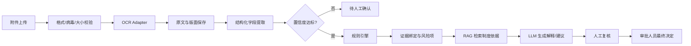

# OCR、LLM、Agent、RAG 技术设计

> 版本：V0.1
>
> 依据：[概要设计总纲](./02-概要设计总纲.md)、[方案决策与待确认项](./01-方案决策与待确认项.md)。
>
> 审核说明：本文档需要整体审核；“【重点审核】”只表示需要优先检查的关键边界和安全约束。

## 1. 设计目标

本设计为附件解析、字段提取、风险规则执行和制度依据检索提供统一适配层，保证不同 OCR、模型和检索实现可替换，同时保留输入、输出、版本、证据和调用审计。

## 2. 组件职责边界

| 组件 | 负责 | 不负责 | 输出必须包含 |
|---|---|---|---|
| OCR Adapter | PDF/图片文字、版面、页码和坐标识别 | 风险判断、审批决定 | 原文、页码、坐标、置信度、服务版本 |
| Structured Extractor | 发票、合同、行程单和费用明细字段提取 | 修改原始文件、最终风险判定 | 字段路径、字段值、来源位置、置信度 |
| Rule Engine | 金额、完整性、重复票据等确定性规则 | 自主调用外部模型、改变审批状态 | 命中结果、实际值、参考值、阈值、规则版本 |
| LLM Adapter | 歧义字段补全、跨文档语义解释、处理建议 | 直接决定风险等级或审批状态 | 模型、提示版本、输入摘要、输出、置信度 |
| Agent Orchestrator | 按固定流程编排工具调用 | 自主规划未授权工具、写入最终状态 | 工具调用链、参数摘要、结果引用、错误 |
| RAG Retriever | 检索制度、费用标准和规则依据 | 直接生成审批结论 | 文档版本、段落位置、相似度、引用片段 |

【重点审核 R-07、R-09】规则引擎必须是风险判定主路径；LLM 和 Agent 只能在授权边界内辅助，不能改变审批状态。

## 3. 端到端处理流程



【重点审核 R-08、R-11、R-12】每个阶段必须绑定单据版本；失败时从失败节点恢复，不得丢失原始附件和证据。

## 4. OCR 与结构化抽取

### 4.1 OCR 适配器接口

```python
class OCRProvider(Protocol):
    async def recognize(
        self,
        file_ref: FileRef,
        *,
        document_version_id: UUID,
    ) -> OCRResult: ...
```

`OCRResult` 至少包含：`provider`、`provider_version`、`pages`、`raw_text`、`blocks`、`confidence`、`error`。

### 4.2 字段抽取要求

每个字段保存：

- 字段路径，例如 `invoice.total_amount`；
- 规范化值和原始值；
- 来源附件、页码、坐标或文本范围；
- 识别置信度；
- 抽取器版本和时间；
- 是否需要人工确认。

金额字段必须使用 `Decimal`，保存 2 位小数并保留币种；MVP 只做同币种比较。

## 5. 规则引擎

### 5.1 执行原则

1. 规则输入必须来自当前不可变单据版本。
2. 规则执行必须是确定性的，同一输入和规则版本得到同一结果。
3. 每个命中结果必须输出实际值、参考值、阈值、差异、来源和证据。
4. 缺少必要字段或证据时输出“数据不足/待人工确认”，不得猜测。
5. 规则版本必须写入风险分析和报告。

### 5.2 规则结果结构

```json
{
  "risk_type": "invoice_amount_consistency",
  "severity": "medium",
  "status": "hit",
  "actual_value": "1200.00",
  "reference_value": "1000.00",
  "threshold": "0.05",
  "currency": "CNY",
  "rule_version": "expense-v1",
  "evidence_ids": ["ev_001"],
  "needs_human_review": true
}
```

综合评级采用最高单项风险等级并结合风险数量的确定性修正；具体参数在风险规则文档中固化，禁止由 LLM 临时决定。

## 6. LLM 适配器

### 6.1 允许的任务

- 将 OCR 字段和上下文补全为候选结构化字段；
- 解释规则命中原因；
- 根据已绑定证据生成处理建议；
- 识别跨文档语义关系并返回候选结果。

### 6.2 禁止的任务

- 直接写入“通过、退回、驳回”等最终状态；
- 无证据生成确定性风险结论；
- 覆盖规则引擎结果；
- 访问未授权单据或调用未登记工具。

### 6.3 调用记录

每次调用记录模型名称、模型版本、提示版本、输入数据范围、脱敏状态、输出摘要、置信度、耗时、错误和操作者/任务 ID。

## 7. Agent 编排

Agent 不是自由决策器，而是受限的流程编排器。MVP 使用固定状态图和工具白名单：

```text
parse_attachment
  -> extract_fields
  -> validate_required_fields
  -> run_rules
  -> retrieve_policy
  -> generate_explanation
  -> persist_review_result
```

每个工具声明输入 schema、输出 schema、权限、超时、重试策略和幂等键。Agent 无权调用审批状态变更工具；审批状态只能由审批模块根据审批人员操作写入。

## 8. RAG 制度检索

### 8.1 数据范围

- 费用标准；
- 差旅制度；
- 采购和付款制度；
- 发票和附件规范；
- 已发布的风险规则说明。

### 8.2 检索结果要求

检索结果必须携带制度文档 ID、版本、生效日期、段落位置、引用片段和相似度。只允许检索已发布且在有效期内的文档。

### 8.3 生成约束

LLM 生成建议时只能引用检索结果和当前风险证据；没有匹配制度时明确返回“无适用制度依据”，不得编造条款。

## 9. 数据安全与私有化

【重点审核 R-10、R-17】

1. 真实财务数据默认只进入私有化 OCR/LLM/RAG 服务。
2. 外部模型默认禁止接收真实数据。
3. 确需外发时，必须字段级脱敏、审批授权、最小化传输、加密传输、控制留存期限并记录调用审计。
4. 日志不得记录身份证号、完整银行卡号、完整发票号码和附件原文；使用脱敏摘要或哈希。
5. 适配器配置中明确数据出域策略，调用前强制校验，策略不满足时拒绝调用。

## 10. 失败与人工接管

| 阶段 | 可重试 | 失败后动作 |
|---|---|---|
| OCR | 是 | 从 OCR 节点重试，保留上次错误 |
| 字段抽取 | 是 | 标记低置信度并进入人工确认 |
| 规则执行 | 是 | 检查规则版本和输入完整性后重试 |
| RAG 检索 | 是 | 无依据时返回明确提示，不阻塞人工审批 |
| LLM 解释 | 是 | 可降级为规则结果和模板化建议 |
| 报告生成 | 是 | 从报告节点重试，不重复风险分析 |

## 11. 评估指标框架

指标先定义统计口径，再使用真实或脱敏样本补齐目标值：

- OCR 字段级准确率；
- 风险规则命中准确率；
- 证据完整率；
- 低置信度识别率；
- 任务成功率和重试成功率；
- LLM 建议引用证据的合规率；
- OCR、分析和报告生成耗时。
