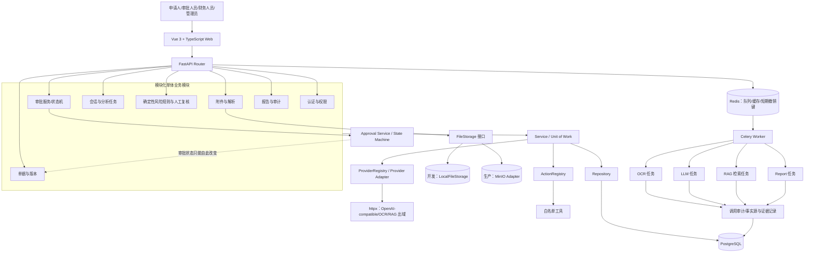
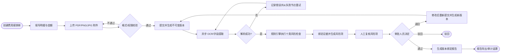
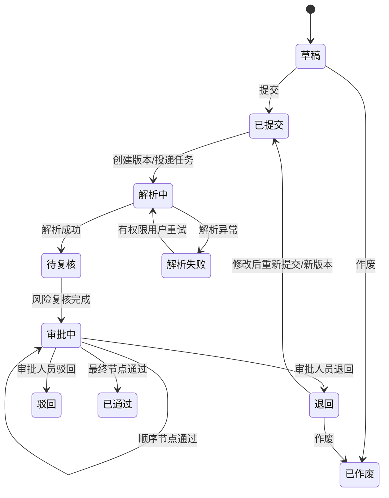
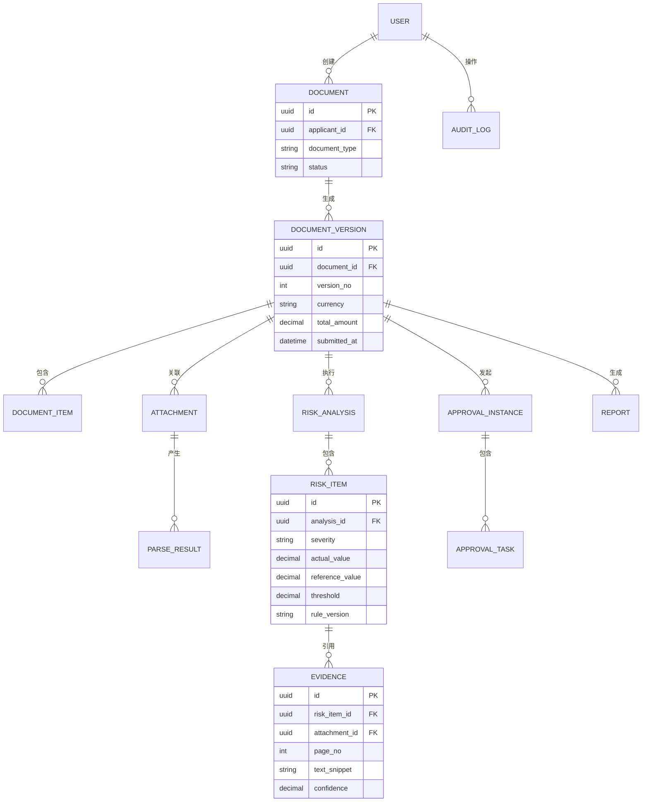

# 系统架构与核心流程图

> 使用 `diagram-builder` 技能生成 Mermaid 图表。
>
> 本文件需要整体审核；标记“【重点审核】”的图表优先检查。

## 1. 系统总体架构图

【重点审核 R-15、R-16、R-17：技术栈、MinIO、OCR/模型适配层及数据出域边界。】

### 调用边界说明

- `Settings` 是配置唯一入口；Router 不直接读取环境变量。
- `AsyncSession` 由请求依赖创建，Service 通过 `Unit of Work` 管理事务，Repository 负责持久化。
- `ProviderRegistry` 选择 OCR、LLM 和 RAG Provider；Provider Adapter 只能通过 `httpx` 调用 OpenAI-compatible 或其他受控服务，必须释放响应和连接。
- `ActionRegistry` 只暴露白名单工具，并在执行前完成权限校验；Agent 不得直接调用未注册工具。
- PostgreSQL 中的单据版本、风险、审批和报告是业务事实源；会话、Redis 和模型输出不能替代事实源。
- 审批状态只能由 `Approval Service / State Machine` 改变，Agent、Provider 和普通 Service 不得直接改写审批状态。

## 2. 费用报销单样板链路

【重点审核 R-01、R-02、R-04、R-08、R-11、R-12：样板范围、人工审批、退回重提、证据、重试和版本绑定。】

## 3. 单据状态机

【重点审核 R-04、R-05：退回后从首节点重新开始，MVP 仅顺序审批。】

## 4. 核心数据关系图

【重点审核 R-03、R-06、R-08、R-12：数据权限、金额精度、证据链和版本绑定。】

## 5. 审核顺序

1. 先审核总体架构是否符合模块化单体和既定技术栈。
2. 再审核费用报销单样板链路是否完整闭环。
3. 再审核退回、重试、人工审批和版本绑定。
4. 最后审核数据对象的金额、证据、权限字段。
